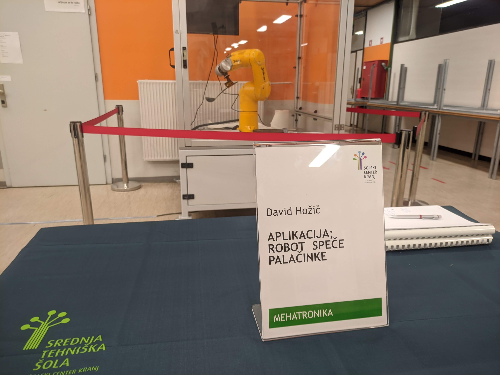

Robot Pancakes
=====================

Robot Pancakes is a project of mine for a robot capable of autonomous pancake making.
The robot used is an anthropomorphic 6-axis Staubli arm.
Robot was provided by `Domel <https://www.domel.com/>`_.

Cell structure
======================
Robot is enclosed into a cell.
If the cell is opened the robot will not function.

There are 4 things inside the cell. The first is the robot, placed in the middle of the cell.
Then there is the pre-made pancake mass placed on the left side of the cell.
In the middle of the cell, the cooker is placed, which burns at constant temperature.
Finally, on the right of the cell the drop-off for the cooked pancakes is placed.

.. image:: ./images/robot_cell_look.jpg

Showcase
===================
The following videos show how the robot works.

.. raw:: html

    <iframe width="560" height="315"
    src="https://www.youtube.com/embed/hvL5HrFYIbQ?si=VXydMb7YQ68hfHx6"
    title="YouTube video player" frameborder="0" allow="accelerometer; autoplay; clipboard-write;
    encrypted-media; gyroscope; picture-in-picture; web-share" allowfullscreen></iframe>

    <iframe width="560" height="315" src="https://www.youtube.com/embed/rapcsV_Vs6E?si=cuEQOVzlFBghtyQC"
    title="YouTube video player"
    frameborder="0" allow="accelerometer; autoplay; clipboard-write; encrypted-media; gyroscope; picture-in-picture;
    web-share" allowfullscreen></iframe>

    <iframe width="560" height="315" src="https://www.youtube.com/embed/Xcvc2gvJSdQ?si=9JeSP4ba_3nUkyuI"
    title="YouTube video player" frameborder="0" allow="accelerometer; autoplay; clipboard-write; encrypted-media;
    gyroscope; picture-in-picture; web-share" allowfullscreen></iframe>

