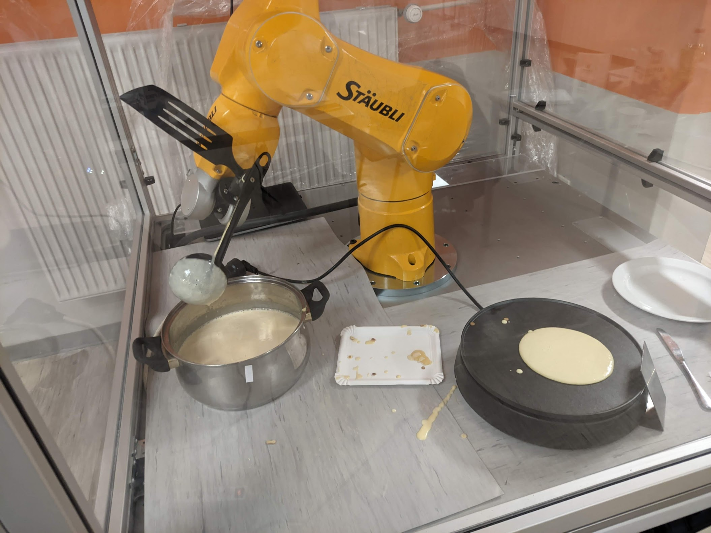

Robot Pancakes
=====================

Robot Pancakes is a project of mine for a robot capable of autonomous pancake making.
The robot used is an anthropomorphic 6-axis Staubli arm.
Robot was provided by `Domel <https://www.domel.com/>`_.

Cell structure
======================
Robot is enclosed into a cell.
If the cell is opened the robot will not function.

There are 4 things inside the cell. The first is the robot, placed in the middle of the cell.
Then there is the pre-made pancake mass placed on the left side of the cell.
In the middle of the cell, the cooker is placed, which burns at constant temperature.
Finally, on the right of the cell the drop-off for the cooked pancakes is placed.

Showcase
===================
The following videos show how the robot works.
The following images are **YouTube videos**.

.. figure:: https://i.ytimg.com/vi/hvL5HrFYIbQ/maxresdefault.jpg
    :target: https://www.youtube.com/watch?v=hvL5HrFYIbQ

    Pouring the mass

.. figure:: https://i.ytimg.com/vi/rapcsV_Vs6E/maxresdefault.jpg
    :target: https://www.youtube.com/watch?v=rapcsV_Vs6E

    Flipping the pancake

.. figure:: https://i.ytimg.com/vi/Xcvc2gvJSdQ/maxresdefault.jpg
    :target: https://www.youtube.com/watch?v=Xcvc2gvJSdQ

    Serving the pancake
